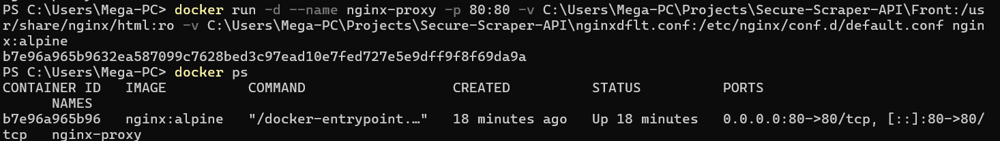
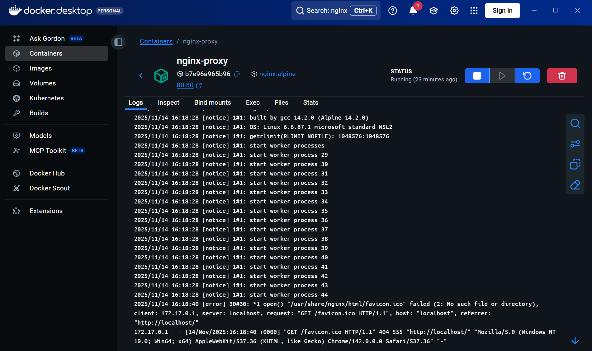

# Nginx-Server
Recap: Deployed an Nginx web server within a Docker container using Docker Desktop on a Windows host (is not typical deployment but it reinforced my skills and knowledge in different environments) to serve static content via HTTP, verifying container connectivity and configuration, and monitoring it using the dashboard.

In this lab, I provisioned a Docker container from a windows machine and installed the Nginx web server software. I configured Nginx to listen on the default HTTP port (80) and set up a basic server block to serve a custom static HTML page. modified directives in the nginx.conf file to make the default page to mine instead of nginx's. The final step involved starting the Nginx service and validating successful deployment by accessing the server's IP address from a client machine to ensure the web page was displayed correctly and monitoring its behaviour:

First i picked the container image from DockerHub that's the best fit for scalable projects: "nginx:alpine"


But instead of just hitting run, i went for more manual customization and ran the necessary commands (this command was finally the one after multiple attempts and trial and error and configuration tweaks, which helped me understand docker and the nginx server more):

```docker run -d --name nginx-proxy -p 80:80 -v C:\Users\Amin\Projects\Secure-Scraper-API\Front:/usr/share/nginx/html:ro -v C:\Users\Amin\Projects\Secure-Scraper-API\nginxdflt.conf:/etc/nginx/conf.d/default.conf nginx:alpine```


why that command? well...
```-d``` so the current terminal isn't occupied by the running container, and it runs in the BG instead
```-v``` which dynamically mounts files and directories in the container from the host machine, meaning; editing the files in the host machine will be reflected in the container **But only if you hit ```nginx -s reload```** (this was a life-saver)

```-v C:\Users\Amin\Projects\Secure-Scraper-API\Front:/usr/share/nginx/html``` for copying the html files to be served in the container
```:ro``` for making the files read only for better **security**
and finally:
```-v C:\Users\Amin\Projects\Secure-Scraper-API\nginxdflt.conf:/etc/nginx/conf.d/default.conf``` to copy my custom configuration file in the container to be included later into the main nginx.conf.


and my configuration file was:
```
server {
    listen 80;
    server_name  7ammaserver;

    location / {
        root   /usr/share/nginx/html;
        index  Home.html index.html index.htm;
    }
}
```
```root   /usr/share/nginx/html;``` this tells nginx where to look for files when ```/``` is called
```index  Home.html index.html index.htm;``` this allows the server to directly serve my ```Home.html``` instead of the default nginx welcome page when ```/``` is called


**Finally**, when accessed, the server serves the files as intended:


And I know the server container is up and running with no issues, thanks to the docker desktop comprehensive and simple container monitoring dashboard, where i can see status, monitor logs, ressource usage and control numerous configs of the container:




